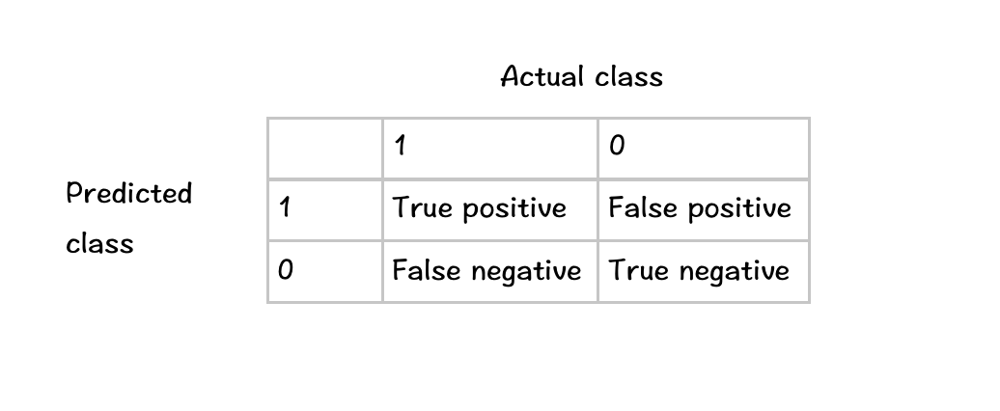

# Machine Learning Formulae

## Notations

$m$ = Number of training examples.

$n$ = Number of features.

$x^{(i)}$ = The features of the $i_{th}$ training example, which is an $n+1$ vector.

$y^{(i)}$ = The Target value of the $i_{th}$ training example, which is a number.

$(x^{(i)}, y^{(i)})$ = The $i_{th}$ training example.

$x_j^{(i)}$ = The $j_{th}$ feature of the $i_{th}$ training example, which is a number.

$\alpha$ = Learning rate

## Multivariate Linear Regression 

### Hypothesis

$h_x(\theta)=\sum_{i=0}^n\theta_ix_i$                 $x_0$ is always equal to 1.

### Cost Function

$J(\theta)=\frac{1}{2m}\sum_{i=1}^m(h_\theta(x^{(i)})-y^{(i)})^2)$

### Gradient Desecnt

`Repeat{`

​		$\theta_j := \theta_j - \alpha\frac{\partial}{\partial\theta_j}J(\theta)$

​        $(j=0,1,2,...,n)$, $\alpha$ stands for learning rate.

`}`

Calculate the $\frac{\partial}{\partial\theta_j}J(\theta)$, which means the partial derivative respect to $\theta_j$:

`Repeat{`

​		$\theta_j := \theta_j - \alpha\frac{1}{m}\sum_{i=1}^m(h_\theta(x^{(i)})-y^{(i)})x_j^{(i)}$

`}`

### Feature Scaling

Replace every $x$ with: 

$\frac{x-\mu}{s}$

$\mu$ stands for the average of x's, and $s$ stands for the standard deviation of x's.

### Normal Equation

Define the feature vector of the $i_{th}$ training example:

$x^{(i)}=\begin{bmatrix}x_0^{(i)}\\\\x_1^{(i)}\\\\...\\\\x_n^{(i)}\end{bmatrix}$                                 $x^{(i)}$ is an $n+1$ vector.

Define ***design matrix*** X:

$X=\begin{bmatrix}(x^{(1)})^T\\\\(x^{(2)})^T\\\\...\\\\(x^{(m)})^T\end{bmatrix}$                            $X$ is an $m\times(n+1)$ matrix.

Define the target value vector:

$y=\begin{bmatrix}y^{(1)}\\\\y^{(2)}\\\\...\\\\y^{(m)}\end{bmatrix}$                                  y is an $m\times(n+1)$ vector.

Then, we can calculate $\theta$:

$\theta=(X^TX)^{-1}X^Ty$                     $\theta$ Is an $n+1$ vector.

## Logistic Regression

### Hypothesis

Define:

$\theta=\begin{bmatrix}\theta_0\\\\\theta_1\\\\...\\\\\theta_n\end{bmatrix}$                     $x=\begin{bmatrix}x_0\\\\x_1\\\\...\\\\x_n\end{bmatrix}$

Hypothesis:

$h_\theta(x)=g(\theta^Tx)$

$g(z)=\frac{1}{1+e^{-z}}$    (sigmoid/logistic function)

which means:

$h_\theta(x)=\frac{1}{1+e^{-\theta^Tx}}\in (0,1)$

### Cost Function

$J(\theta)=\frac{1}{m}\sum_{i=1}^mCost(h_\theta(x^{(i)}),y^{(i)})$

$Cost(h_\theta(x^{(i)}),y^{(i)})=\begin{cases}-log(1-h_\theta(x)),\quad y=0\\\\-log(h_\theta(x)), \quad y=1\end{cases} \iff Cost(h_\theta(x^{(i)}),y^{(i)})=-ylog(h_\theta(x))-(1-y)log(1-h_\theta(x))$

### Gradient Descent

`Repeat{`

​		$\theta_j := \theta_j - \alpha\frac{1}{m}\sum_{i=1}^m(h_\theta(x^{(i)})-y^{(i)})x_j^{(i)}$

`}`

### Multiclass Classification

Train a logistic regression classifier $h_\theta^{(i)}(x)$ for each class $i$ to predict the probability that $y=i$. On a new input $x$, to make a prediction, pick the class $i$ that maximizes $h_\theta^{(i)}(x)$.

## Regularized Linear Regression

### Cost Function

$J(\theta)=\frac{1}{2m}\lbrack\,\sum_{i=1}^m(h_\theta(x^{(i)})-y^{(i)})^2 + \lambda\sum_{i=1}^n\theta_j^2\,\rbrack$

### Gradient Descent

`Repeat{`

​		$\theta_0 := \theta_0-\alpha\frac{1}{m}\sum_{i=1}^m(h_\theta(x^{(i)})-y^{(i)})x_0^{(i)}$

​		$\theta_j := \theta_j-\alpha\lbrack\,\frac{1}{m}\sum_{i=1}^m(h_\theta(x^{(i)})-y^{(i)})x^{(j)}+\frac{\lambda}{m}\theta_j\,\rbrack$

​		$(j=1,2,3,...,n)$

`}`

### Normal Equation

$\theta=(X^TX+\lambda\begin{bmatrix}0&0&0&0&...&0\\\\0&1&0&0&...&0\\\\0&0&1&0&...&0\\\\0&0&0&1&...&0\\\\...\\\\0&0&0&0&...&1\end{bmatrix})^{-1}X^Ty$

## Regularized Logistic Regression

### Cost Function

$J(\theta)=-\lbrack\,\frac{1}{m}\sum_{i=1}^my^{(i)}logh_\theta(x^{(i)})+(1-y^{(i)})log(1-h_\theta(x^{(i)}))\,\rbrack+\frac{\lambda}{2m}\sum_{j=1}^n\theta_j^2$

### Gradient Desecnt

`Repeat{`

​		$\theta_0 := \alpha\frac{1}{m}\sum_{i=1}^m(h_\theta(x^{(i)})-y^{(i)})x_0^{(i)}$

​		$\theta_j := \theta_j-\alpha\lbrack\,\frac{1}{m}\sum_{i=1}^m(h_\theta(x^{(i)})-y^{(i)})x_j^{(i)}+\frac{\lambda}{m}\theta_j\,\rbrack$

​		$(j=1,2,3,...,n)$

`}`

## Neural Network

### Architecture

$a_i^{(j)}$ = activation of unit $i$ in layer $j$

$\theta^{(j)}$ = matrix of weights controlling function mapping from layer $j$ to layer $j+1$

E.g.

X=$\begin{bmatrix}x_0\\\\x_1\\\\x_2\\\\x_3\end{bmatrix}$                                                 $\theta^{(1)}=\begin{bmatrix}\theta_{10}^{(1)}&\theta_{11}^{(1)}&\theta_{12}^{(1)}&\theta_{13}^{(1)}\\\\\theta_{20}^{(1)}&\theta_{21}^{(1)}&\theta_{22}^{(1)}&\theta_{23}^{(1)}\\\\\theta_{30}^{(1)}&\theta_{31}^{(1)}&\theta_{32}^{(1)}&\theta_{33}^{(1)}\end{bmatrix}\in R^{3\times4}$

$a_1^{(2)}=g(\theta_{10}^{(1)}x_0+\theta_{11}^{(1)}x_1+\theta_{12}^{(1)}x_2+\theta_{13}^{(1)}x_3)$            Define: $z_1^{(2)}=\theta_{10}^{(1)}x_0+\theta_{11}^{(1)}x_1+\theta_{12}^{(1)}x_2+\theta_{13}^{(1)}x_3$

$a_2^{(2)}=g(\theta_{20}^{(1)}x_0+\theta_{21}^{(1)}x_1+\theta_{22}^{(1)}x_2+\theta_{23}^{(1)}x_3)$            Define: $z_2^{(2)}=\theta_{20}^{(1)}x_0+\theta_{21}^{(1)}x_1+\theta_{22}^{(1)}x_2+\theta_{23}^{(1)}x_3$

$a_3^{(2)}=g(\theta_{30}^{(1)}x_0+\theta_{31}^{(1)}x_1+\theta_{32}^{(1)}x_2+\theta_{33}^{(1)}x_3)$            Define: $z_3^{(2)}=\theta_{30}^{(1)}x_0+\theta_{31}^{(1)}x_1+\theta_{32}^{(1)}x_2+\theta_{33}^{(1)}x_3$

$\Longleftrightarrow$              $a^{(2)}=g(\theta^{(1)}X)$                      $\Longleftrightarrow$                      $a^{(2)}=g(z^{(2)})$   

### Cost Function

$L$ = total number of layers in network

$S_l$ = number of units(not counting bias unit) in lay $l$.

$h_\theta(x) \in R^K$    (which means there are $K$ units in the output layer)

$(h_\theta(x))_i$ = $i^{th}$ output

$J(\theta)=-\frac{1}{m}\lbrack \sum_{i=1}^m\sum_{k=1}^Ky_k^{(i)}log(h_\theta(x^{(i)}))_k+(1-y_k^{(i)})log(1-(h_\theta(x^{(i)}))_k) \rbrack + \frac{\lambda}{2m}\sum_{l=1}^{L-1}\sum_{i=1}^{S_l}\sum_{j=1}^{S_{l+1}}(\theta_{ji}^{(l)})^2$

### Back Propagation

Intuition:    $\delta_j^{(l)}$ = error of node $j$ in layer $l$

Suppose $L=4$, that is, there are 4 layers in the network in total:

For each output unit($l=4$):

$\delta_j^{(4)}=a_j^{(4)}-y_j$                 

Vectorization:  $\delta^{(4)}=a^{(4)}-y$

For other layers:

$\delta^{(3)}=(\theta^{(3)})^T\delta^{(4)}.*g^{'}(z^{(3)})=a^{(3)}.*(1-a^{(3)})$

$\delta^{(2)}=(\theta^{(2)})^T\delta^{(3)}.*g^{'}(z^{(2)})=a^{(2)}.*(1-a^{(2)})$

...

Algorithm:

Training set $\{(x^{(1)}, y^{(1)}), (x^{(2)}, y^{(2)}),...,(x^{(m)}, y^{(m)})\}$

Set $\Delta_{ij}^{(l)}=0$ (for all $l,i,j$)

For $i=1$ to $m$

​    Set $a^{(1)}=x^{(i)}$

​    Perform forwar propagation to compute $a^{(l)}$ for $l=1,2,3...,L$

​    Using $y^{(i)}$, compute $\delta^{(L)}=a^{(L)}-y^{(i)}$

​    Compute $\delta^{(L-1)}, \delta^{(L-2)}, ..., \delta^{(2)}$

​    $\Delta_{ij}^{(l)}:=\Delta_{ij}^{(l)}+a_j^{(l)}\delta_i^{(l+1)}$

​    Define $D_{ij}^{(l)}=\frac{\partial}{\partial\theta_{ij}^{(l)}}J(\theta)$       $\Longleftrightarrow$     $D_{ij}^{(l)}=\lgroup_{\frac{1}{m}\Delta_{ij}^{(l)}\quad\quad\quad if\ j=0}^{\frac{1}{m}\Delta_{ij}^{(l)}+\lambda\theta_{ij}^{(l)}\quad\, if\ j\ne0}$  

​    $\theta_{ij}^{(l)}:=\theta_{ij}^{(l)}-\alpha D_{ij}^{(l)}$    

## Debugging Summary

### To fix high variance(Overfitting):

1. Get more training examples.
2. Try a small sets of features.
3. Try increasing $\lambda$

## To fix high bias(Underfitting):

1. Try get additional features.
2. Try adding polynomial features($x_1^2, x_2^2$)
3. Try decreasing $\lambda$

## Error metrics for skewed classes

Explanation for "skewed classes":

Train logistic regression model $h_\theta(x)$ ($y \in \{0, 1\}$). Find that you got 1% error on test set(99% correct). But, if the test set contains only 0.5% data which $y=1$, the following function:

`function y = predict(x);`

`y=0;`

`return;`

gives a better error 0.5%. Such test set is called a "skewed class".

### Error metrics

$Precision=\frac{True\, positive}{True\, positive+False\, positive}$   (表示在被预测为1的样例中，真正是1的样例的个数)

$Recall=\frac{True\, positive}{True\, positive+False\, negative}$          (表示在所有真正是1的训练样例中，被预测为1的样例的个数)

### Trading off precision and recall

Define threshhold:

Predict 1 if $h_\theta(x)\geq threshhold$, else predict 0.

Suppose we want to predict $y=1$ only if very confident(high threshhold), it results in higher precision and lower recall.

Suppose we want to avoid missing too many cases of $y=1$, it results in higher recall and lower precision.

### How to choose threshhold?

Define:

$F_1\, Score=2\frac{Precision\times Recall}{Precision+Recall}$  (also called $F\, Score$)

We wish to have an as high $F_1\, Score$ as possible.

## Support Vector Machine(SVM)

### Hypothesis

$h_\theta(x)=\lgroup_{0\quad if\, \theta^Tx\le-1}^{1\quad if\, \theta^Tx\geq1}$

### Cost Function

$J(\theta)=C\sum_{i=1}^{m}\lbrack\, y^{(i)}cost_1(\theta^Tx^{(i)})+(1-y^{(i)})cost_0(\theta^Tx^{(i)})\,\rbrack+\frac{1}{2}\sum_{i=1}^{n}\theta_j^2$

$cost_0(z)=\lgroup_{0\quad\quad\;\, z\ge1}^{-z+1\quad z<1}$

$cost_1(z)=\lgroup_{z+1\quad\quad\;\, z\ge-1}^{0\quad z<-1}$

Predict $y=1$ if $\theta^Tx\ge1$, and predict $y=0$ if $\theta^Tx\le-1$.

### Kernel

Training set $\{(x^{(1)},\,y^{(1)}), (x^{(2)},\,y^{(2)}),...,(x^{(m)},\,y^{(m)})\}$

Choose $l^{(1)}=x^{(1)},l^{(2)}=x^{(2)},...,l^{(m)}=x^{(m)}$

For training example $(x^{(i)}, y^{(i)})$:

​	Replace $x^{(i)}$ with:   $f_0^{(i)}=1$

​                                           $f_1^{(i)}=similarity(x^{(i)}, l^{(1)})$

​                                           $f_2^{(i)}=similarity(x^{(i)},l^{(2)})$

​                                           $...$

​                                           $f_m^{(i)}=similarity(x^{(i)},l^{(m)})$

​	$\Longrightarrow$                             $f^{(i)}=\begin{bmatrix}f_0^{(i)}\\\\f_1^{(i)}\\\\f_2^{(i)}\\\\...\\\\f_m^{(i)}\end{bmatrix} \in R^{m+1}$                                ($f^{(i)}$ is the new feature.)                

Predict $y=1$ if $\theta^Tf^{(i)}\ge0$.

Function $similarity$ is called ***"Kernel"***.

#### Gaussian Kernel

$similarity(x, l)=e^{-\frac{\Arrowvert x-l\Arrowvert^2}{2\sigma^2}}$

#### Polynomial Kernel

$similarity(x, l)=(x^Tl+C)^d$

#### Cost Function with Kernel

$J(\theta)=C\sum_{i=1}^{m}\lbrack\,y^{(i)}cost_1(\theta^Tf^{(i)})+(1-y^{(i)})cost_0(\theta^Tf^{(i)})\,\rbrack+\frac{1}{2}\sum_{j=1}^m\theta_j^2$

​                                     

